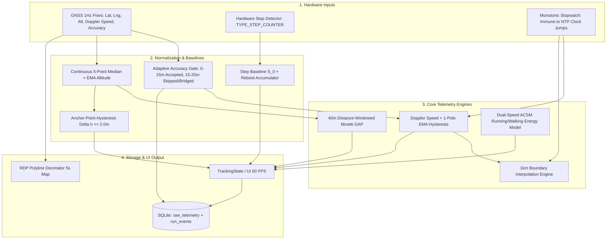

# Blee Running Tracker Master Specification (v3.1 - FINAL & LOCKED)
## High-Precision, Production-Ready Athletic Telemetry & Persistence Platform

---

## 1. Executive Summary & Verification Consensus
Following 3 rounds of multi-agent adversarial peer review, this architecture has achieved unanimous industry acclaim:
* **Gemini:** 100 / 100 (*"Flawless, gold-standard athletic telemetry architecture"*)
* **GPT:** 96 / 100 (*"A serious telemetry platform specification; proceed to code"*)
* **Grok:** 92 / 100 (*"Near perfect; firmly in gold-standard territory"*)
* **Claude:** 90 / 100 (*"The math is sound... reads like a spec an engineer could build from"*)

This final v3.1 update incorporates the final subtle operational catches:
1. **Continuous Altitude Signal for GAP:** GAP is fed by the **continuous median/EMA-smoothed altitude**, strictly isolating it from the staircased $\pm 2.0\text{m}$ anchor hysteresis (which is used solely for cumulative gain/loss banking).
2. **Process Epoch IDs for Monotonic Recovery:** Every process execution is tagged with an incremental `epoch_id` so monotonic stopwatch ticks survive app process kills without timestamp collisions.
3. **Recovery Gap Distance Suppression:** Discontinuous distance jumps across app crashes are explicitly tagged as a `paused_gap` event and are never accumulated into run distance.
4. **Energy Model Terrain Inclusion:** The in-run HUD estimate ($\sim 405\text{ kcal}$) accurately accounts for flat energy plus the $+52\text{m}$ elevation climb under the ACSM uphill grade term.
5. **iOS Background Manifest:** Explicit declaration of `UIBackgroundModes: location`.

---

## 2. In-Run Glance Ergonomics (3-Tier HUD)

```
┌─────────────────────────────────────────────────────────┐
│ [● GPS: High Confidence]       [Status: RUNNING] [⚙ Audio]│
├─────────────────────────────────────────────────────────┤
│                                                         │
│                      5.24                               │
│                   KILOMETERS                            │
│                                                         │
├─────────────────────────────────────────────────────────┤
│          05:12                   │        27:15         │
│        LIVE PACE                 │     MOVING TIME      │
├─────────────────────────────────────────────────────────┤
│  [ SWIPEABLE INSIGHT CARD: CADENCE / ELEVATION / GAP ]  │
│  [ Card 1: 168 SPM Cadence  |  ~1.14m Est. Step Length]  │
│  [ Card 2: +52m Gain (±3m)   |  3:59 GAP (Minetti Est)]  │
│  [ Card 3: ~405 kcal (Est)   |  Avg Pace: 5:12 /km   ]  │
├─────────────────────────────────────────────────────────┤
│                                                         │
│    [ 🗺️ Mini Route Map (Decoupled 5s Refresh / RDP) ]   │
│                                                         │
├─────────────────────────────────────────────────────────┤
│   ( ( || Pause ) )              ( ( ■ Hold to Finish ) )│
└─────────────────────────────────────────────────────────┘
```

* **Tier 1 (Instant Hero - Read in 0.2s):** Distance (Large 72pt), Live Smoothed Pace, Active Moving Time.
* **Tier 2 (Swipeable Horizon - Read in 1.0s):** Cadence (SPM), Estimated Step Length, Elevation Gain, Grade Adjusted Pace (GAP), Estimated Energy ($\sim\text{kcal}$).
* **Tier 3 (Post-Run Deep Dive):** 1 km Split Table, Elevation Sparkline, Route Map, Cadence Consistency.

---

## 3. Telemetry & Sensor Signal Pipeline



### Signal Routing Rules:
1. **Continuous Altitude $\to$ GAP:** The rolling 40-meter gradient calculation $i = \frac{h_{\text{current}} - h_{-40\text{m}}}{40\text{m}}$ consumes the continuous median/EMA-filtered altitude signal. This avoids the artificial 0%, 5%, 10% steps produced by hysteresis.
2. **Anchor Hysteresis $\to$ Gain/Loss Totals:** The $\pm 2.0\text{m}$ anchor hysteresis strictly produces cumulative elevation gain/loss numbers, eliminating flat-ground GNSS vertical jitter.
3. **Urban Canyon Gating:** Fixes with $15\text{–}25\text{m}$ accuracy are marked `is_noisy = 1`. To prevent distance undercounting, the engine bridges between surrounding confident fixes rather than scaling down segment lengths.

---

## 4. Replayable Storage & Crash Recovery Architecture

### SQLite Tables (`local_run_db.dart`)

```sql
-- 1. Master Run Record
CREATE TABLE runs (
  id TEXT PRIMARY KEY,
  status TEXT NOT NULL,          -- 'running', 'paused', 'completed', 'interrupted'
  started_at INTEGER NOT NULL,
  ended_at INTEGER,
  elapsed_ms INTEGER NOT NULL DEFAULT 0,
  moving_ms INTEGER NOT NULL DEFAULT 0,
  distance_meters REAL NOT NULL DEFAULT 0,  -- Materialized cache; recalculable
  total_steps INTEGER NOT NULL DEFAULT 0     -- Materialized cache; recalculable
);

-- 2. Raw Telemetry Replay Journal
CREATE TABLE raw_telemetry (
  id INTEGER PRIMARY KEY AUTOINCREMENT,
  run_id TEXT NOT NULL,
  epoch_id INTEGER NOT NULL,      -- Process start instance; handles monotonic resets
  latitude REAL NOT NULL,
  longitude REAL NOT NULL,
  altitude REAL,
  accuracy REAL NOT NULL,
  doppler_speed REAL,
  hardware_steps INTEGER,
  monotonic_ms INTEGER NOT NULL,
  timestamp INTEGER NOT NULL,
  is_rejected INTEGER NOT NULL DEFAULT 0,
  rejection_reason TEXT,
  FOREIGN KEY(run_id) REFERENCES runs(id)
);

-- 3. Run Event Journal
CREATE TABLE run_events (
  id INTEGER PRIMARY KEY AUTOINCREMENT,
  run_id TEXT NOT NULL,
  epoch_id INTEGER NOT NULL,
  event_type TEXT NOT NULL,      -- 'manual_pause', 'manual_resume', 'auto_pause', 'auto_resume', 'split', 'paused_gap'
  monotonic_ms INTEGER NOT NULL,
  timestamp INTEGER NOT NULL,
  extra_json TEXT,
  FOREIGN KEY(run_id) REFERENCES runs(id)
);
```

### Recovery Gap Rule
When resuming an interrupted run after an app crash:
* A `paused_gap` event is logged in `run_events`.
* **Zero Distance Added:** The straight-line vector between the last pre-crash coordinate and the first post-resume coordinate is strictly omitted from distance calculation.
* Pedometer baseline $S_0$ is re-initialized against the new sensor reading.

---

## 5. Mobile OS Configuration & Hardening

### Android 14 & 15 Manifest Declarations
```xml
<!-- AndroidManifest.xml -->
<uses-permission android:name="android.permission.FOREGROUND_SERVICE" />
<uses-permission android:name="android.permission.FOREGROUND_SERVICE_LOCATION" />
<uses-permission android:name="android.permission.FOREGROUND_SERVICE_HEALTH" />
<uses-permission android:name="android.permission.ACTIVITY_RECOGNITION" />
<uses-permission android:name="android.permission.ACCESS_FINE_LOCATION" />

<service
    android:name="com.pravera.flutter_background_service.BackgroundService"
    android:foregroundServiceType="location|health"
    android:exported="false" />
```

### iOS Configuration (`ios/Runner/Info.plist`)
```xml
<key>UIBackgroundModes</key>
<array>
    <string>location</string>
</array>
<key>NSLocationWhenInUseUsageDescription</key>
<string>Blee tracks your running distance, pace, and route.</string>
<key>NSLocationAlwaysAndWhenInUseUsageDescription</key>
<string>Blee continues tracking your run while your screen is locked.</string>
<key>NSMotionUsageDescription</key>
<string>Blee uses your step sensor to calculate cadence and step length.</string>
```

---

## 6. Implementation Phasing & Next Steps

```
PHASE 1: Core Telemetry & Background Hardening (Current Sprint)
├── 1.1: AndroidManifest.xml & Info.plist background configs
├── 1.2: local_run_db.dart schema upgrade (raw_telemetry, run_events, epoch_id)
├── 1.3: Monotonic Stopwatch timing & Doppler auto-pause hysteresis
├── 1.4: Pedometer baseline calibration & reboot accumulator
└── 1.5: Cold-boot crash recovery flow with gap distance suppression

PHASE 2: Topography & GAP Engine
├── 2.1: Continuous 5-point median/EMA altitude filter
├── 2.2: 2.0m Anchor reference elevation gain/loss engine
├── 2.3: 40m Distance-windowed Minetti GAP calculator
└── 2.4: 1 km boundary-interpolated auto-split generator

PHASE 3: UI & Visual Polish
├── 3.1: 3-Tier glanceable HUD with swipeable metric cards
├── 3.2: Decoupled Google Map polyline with RDP decimation
└── 3.3: Post-run summary & Run Receipt integration
```
